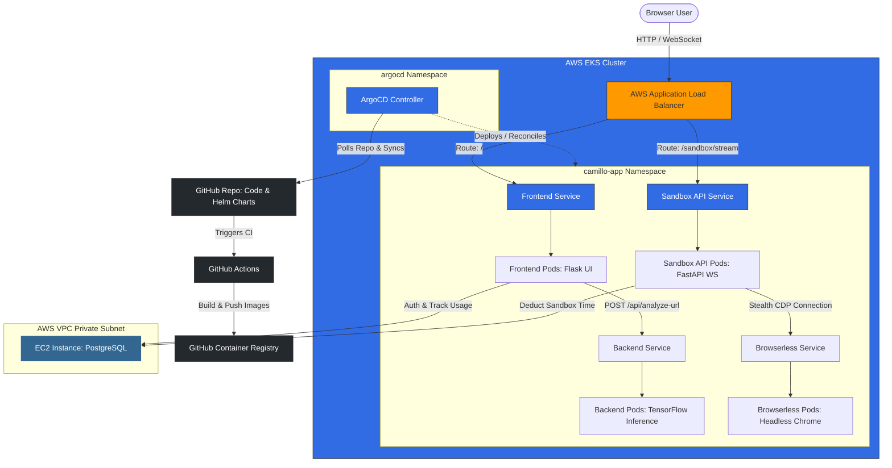

# Camillo-v2: End-to-End GitOps, Cloud Infrastructure, & Sandbox Lifecycle Master Plan

This document outlines the step-by-step blueprint to build, provision, secure, and deploy the entire **Camillo-v2** application from scratch using a modern GitOps pipeline on AWS.

---

## 🏗️ 1. Complete Architecture Diagram

Here is the operational layout of the infrastructure, container registry, database, and CI/CD sync:



---

## 📦 2. Step 1: Building Images and Publishing to GHCR

We publish all container images to GitHub Container Registry (GHCR) so they are version-controlled and pullable by our AWS EKS cluster.

### A. Dockerizing the Services
Each service requires a production-grade Dockerfile:
1. **Frontend (`Camillo-Frontend-main/Dockerfile`)**: Flask server serving HTML templates.
2. **Backend (`Camillo-API-main/Dockerfile`)**: Flask server loading TensorFlow and performing feature extraction.
3. **Sandbox API (`Camillo-Sandbox-main/Dockerfile`)**: FastAPI app handling WebSocket client connections.

### B. CI Pipeline: GitHub Actions Workflow
Create a file at `.github/workflows/publish-images.yml` to build and push images on git tag/push:

```yaml
name: Publish Docker Images to GHCR

on:
  push:
    branches: [ "main" ]
    tags: [ "v*" ]

env:
  REGISTRY: ghcr.io
  IMAGE_OWNER: 0xt3sla # Replace with your GitHub username

jobs:
  build-and-push:
    runs-on: ubuntu-latest
    permissions:
      contents: read
      packages: write

    strategy:
      matrix:
        service: [frontend, backend, sandbox-api]
        include:
          - service: frontend
            context: ./Camillo-Frontend-main
          - service: backend
            context: ./Camillo-API-main
          - service: sandbox-api
            context: ./Camillo-Sandbox-main

    steps:
      - name: Checkout repository
        uses: actions/checkout@v4

      - name: Log in to GitHub Container Registry
        uses: docker/login-action@v3
        with:
          registry: ${{ env.REGISTRY }}
          username: ${{ github.actor }}
          password: ${{ secrets.GITHUB_TOKEN }}

      - name: Set up Docker Buildx
        uses: docker/setup-buildx-action@v3

      - name: Build and Push Image
        uses: docker/build-push-action@v5
        with:
          context: ${{ matrix.context }}
          push: true
          tags: |
            ${{ env.REGISTRY }}/${{ env.IMAGE_OWNER }}/camillo-${{ matrix.service }}:latest
            ${{ env.REGISTRY }}/${{ env.IMAGE_OWNER }}/camillo-${{ matrix.service }}:${{ github.sha }}
          cache-from: type=gha
          cache-to: type=gha,mode=max
```

---

## 📊 3. Step 2: Provisioning AWS EKS and EC2 with Terraform (Free-Tier Mindset)

> [!WARNING]
> While AWS has a Free Tier, EKS itself charges a flat rate of **$0.10/hour** for the control plane. To keep costs at an absolute minimum, we use **t3.micro** or **t3.small** instances for node groups and minimize provisioning of expensive resources (like multiple NAT Gateways).

### A. AWS Network & Infrastructure Setup
We configure a single NAT gateway to avoid paying for multiple gateways, and utilize private subnets for EKS worker nodes.

```hcl
# main.tf

# 1. VPC & Network Setup
module "vpc" {
  source  = "terraform-aws-modules/vpc/aws"
  version = "5.5.0"

  name = "camillo-vpc"
  cidr = "10.0.0.0/16"

  azs             = ["us-east-1a", "us-east-1b"]
  private_subnets = ["10.0.1.0/24", "10.0.2.0/24"]
  public_subnets  = ["10.0.101.0/24", "10.0.102.0/24"]

  # Cost Optimization: Only 1 NAT Gateway shared across private subnets
  enable_nat_gateway = true
  single_nat_gateway = true

  public_subnet_tags = {
    "kubernetes.io/role/elb" = "1"
  }
  private_subnet_tags = {
    "kubernetes.io/role/internal-elb" = "1"
  }
}

# 2. AWS EKS Cluster Configuration
module "eks" {
  source  = "terraform-aws-modules/eks/aws"
  version = "20.2.0"

  cluster_name    = "camillo-cluster"
  cluster_version = "1.29"

  vpc_id     = module.vpc.vpc_id
  subnet_ids = module.vpc.private_subnets

  cluster_endpoint_public_access = true

  eks_managed_node_groups = {
    # Low-cost node group
    spot_nodes = {
      min_size     = 1
      max_size     = 2
      desired_size = 1

      instance_types = ["t3.small"]  # t3.small offers 2GB RAM (needed for TF + Chrome)
      capacity_type  = "SPOT"        # Spot instances save up to 90% of EC2 costs
    }
  }
}
```

### B. Provisioning the PostgreSQL EC2 Instance (AWS Free Tier Eligible)
We deploy an external PostgreSQL database on a standalone **t2.micro** instance running inside the VPC. This falls directly under the 12-month AWS Free Tier.

```hcl
# database.tf

# Security Group for Database Instance
resource "aws_security_group" "db_sg" {
  name        = "camillo-db-sg"
  description = "Allow access to PostgreSQL from EKS nodes"
  vpc_id      = module.vpc.vpc_id

  # Allow PostgreSQL traffic from EKS worker nodes subnet
  ingress {
    from_port   = 5432
    to_port     = 5432
    protocol    = "tcp"
    cidr_blocks = module.vpc.private_subnets_cidr_blocks
  }

  egress {
    from_port   = 0
    to_port     = 0
    protocol    = "-1"
    cidr_blocks = ["0.0.0.0/8"]
  }
}

# PostgreSQL EC2 instance (100% Free-Tier eligible)
resource "aws_instance" "postgres_db" {
  ami           = "ami-0c7217cdde317cfec" # Ubuntu Server 22.04 LTS
  instance_type = "t2.micro"             # Free-tier size
  subnet_id     = module.vpc.private_subnets[0]
  vpc_security_group_ids = [aws_security_group.db_sg.id]

  user_data = <<-EOF
              #!/bin/bash
              apt-get update
              apt-get install -y postgresql postgresql-contrib
              
              # Enable connections from VPC IPs
              sed -i "s/#listen_addresses = 'localhost'/listen_addresses = '*'/g" /etc/postgresql/14/main/postgresql.conf
              echo "host all all 10.0.0.0/16 md5" >> /etc/postgresql/14/main/pg_hba.conf
              
              systemctl restart postgresql
              
              # Set up database and credentials
              sudo -u postgres psql -c "CREATE DATABASE camillodb;"
              sudo -u postgres psql -c "CREATE USER camillo WITH PASSWORD 'SecurePassWord123';"
              sudo -u postgres psql -c "GRANT ALL PRIVILEGES ON DATABASE camillodb TO camillo;"
              EOF

  tags = {
    Name = "camillo-external-db"
  }
}
```

---

## ⛵ 4. Step 3: Creating the Helm Chart

We construct a multi-service Helm Chart located in `/charts/camillo-app` in the GitHub repo to deploy the resources to the cluster.

```
/charts/camillo-app/
├── Chart.yaml
├── values.yaml
└── templates/
    ├── configmap.yaml
    ├── secrets.yaml
    ├── deployment-frontend.yaml
    ├── deployment-backend.yaml
    ├── deployment-sandbox-api.yaml
    ├── deployment-browserless.yaml
    ├── service-frontend.yaml
    ├── service-backend.yaml
    ├── service-sandbox-api.yaml
    ├── service-browserless.yaml
    ├── network-policy.yaml
    └── ingress.yaml
```

### Key Configurations in `values.yaml`
```yaml
global:
  registry: ghcr.io/0xt3sla
  imagePullPolicy: Always

frontend:
  replicaCount: 1
  image: camillo-frontend
  tag: latest

backend:
  replicaCount: 1
  image: camillo-backend
  tag: latest

sandboxApi:
  replicaCount: 1
  image: camillo-sandbox-api
  tag: latest

browserless:
  replicaCount: 1
  image: browserless/chrome
  tag: latest

database:
  host: "10.0.1.55"  # Internal IP address of the Postgres EC2 instance
  name: "camillodb"
  user: "camillo"
```

### Database Secret template (`templates/secrets.yaml`)
```yaml
apiVersion: v1
kind: Secret
metadata:
  name: database-credentials
type: Opaque
data:
  # Base64 encoded values for DB connections
  PGPASSWORD: {{ "SecurePassWord123" | b64enc | quote }}
```

---

## 🐙 5. Step 4: GitOps Deployment with ArgoCD

ArgoCD maintains our cluster state by syncing K8s resources with the Helm manifests stored in GitHub.

### A. Installing ArgoCD in EKS
```bash
# 1. Create target namespace
kubectl create namespace argocd

# 2. Apply the official ArgoCD installation manifests
kubectl apply -n argocd -f https://raw.githubusercontent.com/argoproj/argo-cd/stable/manifests/install.yaml

# 3. Retrieve the ArgoCD web console admin password
kubectl -n argocd get secret argocd-initial-admin-secret -o jsonpath="{.data.password}" | [System.Text.Encoding]::UTF8.GetString([System.Convert]::FromBase64String($_))
```

### B. Declaring the ArgoCD Application Manifest
We create a file `argocd-app.yaml` in our git repo. ArgoCD watches this manifest and deploys the Helm chart:

```yaml
apiVersion: argoproj.io/v1alpha1
kind: Application
metadata:
  name: camillo-app
  namespace: argocd
spec:
  project: default
  source:
    repoURL: 'https://github.com/0xt3sla/Camillo-v2.git'
    targetRevision: HEAD
    path: charts/camillo-app
    helm:
      valueFiles:
        - values.yaml
  destination:
    server: 'https://kubernetes.default.svc'
    namespace: camillo-app
  syncPolicy:
    automated:
      prune: true
      selfHeal: true
    createNamespace: true
```

---

## 🔒 6. Step 5: Implementing Login & Sandbox Daily Limit (20-Minute Cap)

To prevent resource abuse, we force users to login and restrict sandbox utilization to **20 minutes per user daily**.

### A. Database Table Schema
Run this on the EC2 Postgres DB to manage users and track usage metrics:

```sql
CREATE TABLE users (
    id SERIAL PRIMARY KEY,
    username VARCHAR(50) UNIQUE NOT NULL,
    password_hash VARCHAR(256) NOT NULL
);

CREATE TABLE user_sandbox_usage (
    username VARCHAR(50) PRIMARY KEY REFERENCES users(username),
    seconds_used INT DEFAULT 0,          -- Tracked cumulative usage
    last_reset_date DATE DEFAULT CURRENT_DATE
);
```

### B. Implementation Logic: Tracking Session Time (Sandbox API)
When a WebSocket connection opens to stream the sandbox screen, the backend starts a tracking heartbeat.

```python
# Camillo-Sandbox-main/app.py
import asyncio
from datetime import date
import psycopg2

DB_HOST = os.getenv("DB_HOST", "10.0.1.55")
DB_PASSWORD = os.getenv("DB_PASSWORD")

def check_and_deduct_time(username):
    """
    Returns (allowed: bool, time_remaining: int)
    """
    conn = psycopg2.connect(host=DB_HOST, database="camillodb", user="camillo", password=DB_PASSWORD)
    cursor = conn.cursor()
    
    # 1. Reset daily count if date has rolled over
    cursor.execute("SELECT seconds_used, last_reset_date FROM user_sandbox_usage WHERE username = %s;", (username,))
    row = cursor.fetchone()
    
    current_date = date.today()
    if not row:
        cursor.execute("INSERT INTO user_sandbox_usage (username, seconds_used, last_reset_date) VALUES (%s, 0, %s);", (username, current_date))
        conn.commit()
        return True, 1200 # 20 minutes limit (1200 seconds)
        
    seconds_used, last_reset_date = row
    if last_reset_date < current_date:
        cursor.execute("UPDATE user_sandbox_usage SET seconds_used = 0, last_reset_date = %s WHERE username = %s;", (current_date, username))
        conn.commit()
        seconds_used = 0
        
    time_remaining = 1200 - seconds_used
    if time_remaining <= 0:
        return False, 0
    return True, time_remaining

def add_seconds_used(username, seconds):
    conn = psycopg2.connect(host=DB_HOST, database="camillodb", user="camillo", password=DB_PASSWORD)
    cursor = conn.cursor()
    cursor.execute("UPDATE user_sandbox_usage SET seconds_used = seconds_used + %s WHERE username = %s;", (seconds, username))
    conn.commit()
```

Within the WebSocket processing loop:
```python
# FastAPI WebSocket stream handler
@app.websocket("/sandbox/stream")
async def websocket_endpoint(websocket: WebSocket, url: str, username: str):
    await websocket.accept()
    
    allowed, time_remaining = check_and_deduct_time(username)
    if not allowed:
        await websocket.send_json({"type": "error", "message": "Daily limit reached (20 minutes exhausted)."})
        await websocket.close()
        return

    # Keep track of active sandbox elapsed time
    start_time = time.time()
    accumulated_time = 0
    
    try:
        while True:
            # Check elapsed sandbox usage periodically (every 5 seconds)
            await asyncio.sleep(5)
            elapsed = time.time() - start_time
            
            # Commit elapsed seconds to database
            add_seconds_used(username, int(elapsed - accumulated_time))
            accumulated_time = elapsed
            
            # Deduct remaining session time
            allowed, time_remaining = check_and_deduct_time(username)
            if not allowed:
                await websocket.send_json({"type": "timeout", "message": "Daily 20-minute limit exceeded. Sandbox closing."})
                break
                
            # Stream remaining time to client UI
            await websocket.send_json({"type": "time_left", "seconds": time_remaining})
    finally:
        # Save final session duration increments
        final_increment = time.time() - start_time - accumulated_time
        add_seconds_used(username, int(final_increment))
```

---

## 🌐 7. Step 6: Exposing the App via AWS Load Balancer Controller

We expose the application externally using the AWS Load Balancer Controller, which reads our Kubernetes `Ingress` resource and automatically provisions an AWS Application Load Balancer (ALB).

### Ingress Manifest (`templates/ingress.yaml`)
```yaml
apiVersion: networking.k8s.io/v1
kind: Ingress
metadata:
  name: camillo-ingress
  namespace: camillo-app
  annotations:
    # Requests the AWS ALB controller to provision an external Application Load Balancer
    kubernetes.io/ingress.class: alb
    alb.ingress.kubernetes.io/scheme: internet-facing
    alb.ingress.kubernetes.io/target-type: ip
    # Allow WebSocket connections (needed for live sandbox streaming)
    alb.ingress.kubernetes.io/backend-protocol-version: HTTP
spec:
  rules:
    - http:
        paths:
          # Web application UI route
          - path: /
            pathType: Prefix
            backend:
              service:
                name: camillo-frontend-svc
                port:
                  number: 5000
          # WebSocket tunneling route for browser streaming
          - path: /sandbox/stream
            pathType: Prefix
            backend:
              service:
                name: camillo-sandbox-api-svc
                port:
                  number: 8080
```

### Retrieving and Visiting the Load Balancer URL
Once ArgoCD syncs the ingress manifest, run the following command to retrieve the public CNAME URL of the Application Load Balancer:

```bash
kubectl get ingress camillo-ingress -n camillo-app -o jsonpath='{.status.loadBalancer.ingress[0].hostname}'
```
This command outputs an address resembling `k8s-camilloa-camilloi-1234567890.us-east-1.elb.amazonaws.com`. Paste this address into your browser to access the deployed frontend UI, authenticate, and run isolated browser sandboxes under your daily 20-minute budget limit.
